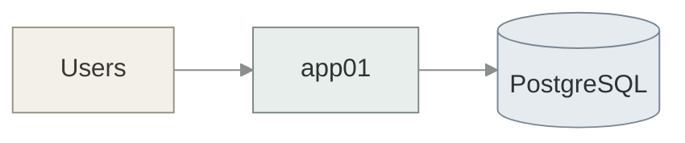

# Mermaid diagrams

Stakeholder diagrams in `docs/` (and `internal_docs/` if the repo uses it). Pair with **`md-formatting`** and **`md-docx-export`**. Do not paste mermaid.live screenshots by hand.

## When to use

- Architecture, network ports, placement, backup, environments
- Any mermaid that EM / KP IT / LU will see in markdown or Word

**Not** for product UI (`--tp-*` tokens). Hex in mermaid `classDef` is required (mermaid cannot use CSS variables).

## Diagram type

Use **`flowchart TB`** or **`flowchart LR`** only.

Do **not** use C4, `architecture-beta`, sequence, or mindmap for these handoffs — GitHub and Word export are uneven.

Blank line before and after every ` ```mermaid ` fence (same rule as tables).

## Prose in the document

The `.md` is a stakeholder document.

**Do put in the file:** what the diagram shows, who connects to whom, ports, deny rules, pointers to the requirements spec for sizes/RTOs.

**Do not put in the file:** how mermaid is rendered, palette names, “GitHub and Cursor”, “SSOT”, “workshop”, “traffic-light”, author asides, install internals (localhost pooler ports, concurrency flags).

Labels: full words where EM/KP will read them (`Database VIP`, `denied`, `staging`). Queue names and hostnames stay as identifiers (`worker01`, `:6432`).

Companion diagrams: sizes, quotas, and open joint items stay in the requirements doc. The diagram file does not restate vCPU/RAM as the source of truth.

## Split crowded views

One flowchart per concern. If edges overlap, split:

| Split | Typical content |
|-------|-----------------|
| Overview | Hosts and main data stores |
| Placement | VM groups (no fake cluster links) |
| Ports by plane | Users / data / ops — not one hairball |
| Isolation | Allowed vs denied |
| Backup | Who writes, which store (Nutanix vs application dumps) |

Do not draw `A --- B` unless A and B are actually paired (e.g. app01 ↔ app02). Two workers on different VMs are not linked.

## Palette (copy into every fence)

Calm stone / sage / slate. Same hex in every diagram in the file. White-friendly for Word PNG.



| Role | `classDef` / `style` | Use |
|------|----------------------|-----|
| edge | `#F3F0EA` / `#9A9286` | Users, VIP, external services |
| compute | `#E8EEEC` / `#7D8B86` | app, workers |
| data | `#E6EBEF` / `#7A8794` | DB, Redis, Neo4j, object storage |
| ops | `#EEEBE6` / `#8B857C` | monitoring, registry, CI |
| ai | `#E6EEF0` / `#6F8A90` | HPE / GPU |
| staging | `#F1EDE6` / `#A09078` | TEST / DEV |
| deny | `#F3E8E6` / `#A87874` | Denied paths only |
| allow subgraph | `#E8EFEA` / `#7A9084` | Allowed staging paths |

Subgraph fill: `style apps fill:#E8EEEC,stroke:#7D8B86,color:#2C3331` (match the plane).

No bright red / green / blue. Denied edges: dotted (`-.->`) plus deny fill — not neon.

## Syntax

- Node IDs: letters/digits only. Never `end`.
- Line breaks in labels: `<br/>`
- Ports on arrows: `A -->|443| B`
- Bidirectional only when real: `App01 <-->|7800| App02`
- `%%{init: ...}%%` is the **first** line inside the fence
- Repeat `classDef` in **each** fence (GitHub does not share styles across blocks)

## After writing

1. Preview the `.md` in the editor.
2. If the user wants Word: **`md-docx-export`** (renders fences to PNG).
3. Do not commit standalone PNG/SVG next to the markdown unless the user asks.

## Related

| Skill | Role |
|-------|------|
| `md-formatting` | Headings, lists, tables, blank lines |
| `md-docx-export` | Compact Word with mermaid as pictures |
