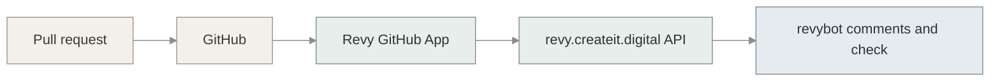

# docs/runbooks/github-revy.md

# GitHub — enable Revy reviewer

How to attach **production Revy** (`https://revy.createit.digital`) to a GitHub repository so pull requests get a Revy check and `revybot` comments.

This is the **consumer** path: add a repo to the GitHub App that already exists. Do **not** create a second GitHub App.

Creating or changing the App (permissions, webhook URL, PEM) is Revy product operations — `docs/utils/GITHUB_APP_SETUP.md` in `~/projects/revy` (GitHub: `raimondskrauklis/revy`). Observatory never registers its own App.

---

## Who already runs Revy

| GitHub repository | Role |
|:---|:---|
| `raimondskrauklis/revy` | **Revy product** — Revy reviews itself (dogfood). Same production App. |
| `raimondskrauklis/rocky-observatory` | **This repo** — game platform consumer. |

kp-platform is another consumer of the same App. Do not copy its `.revy/rules` (SQLAlchemy / QuietChip) into Observatory.

---

## What you are connecting



GitHub delivers `pull_request` (and related) webhooks to Revy. Revy clones the head, reads `.revy/review-context.json` at that SHA, and publishes findings as `revybot`.

---

## Prerequisites

- You can administer the GitHub account or org that owns the repo.
- You can log in to [revy.createit.digital](https://revy.createit.digital) as a workspace admin on a **pro** workspace (`installations.create`).
- The production GitHub App is already installed on **some** account (it is, for `revy` and other consumers). If this is a **new** GitHub user or org, you must Install App first, then register the installation in Revy — see **New GitHub account** below.

---

## Add `rocky-observatory` to the existing install

1. Open GitHub → **Settings** → **Applications** → **Installed GitHub Apps** → **Revy** → **Configure**.

   Direct pattern: `https://github.com/settings/installations/<INSTALLATION_ID>` (the numeric id is in that URL after you open Configure). Personal-account installs also appear under the user Settings page.

2. Under **Repository access**, add `rocky-observatory` (or switch to all repositories if that is already how other consumers are installed).

3. Save.

4. In Revy: **Installations** (`https://revy.createit.digital/installations`) or **Settings → Integrations**. Confirm the installation still lists this account. If the repo does not appear, run **Sync repositories** on that installation.

5. Open a pull request on `rocky-observatory`. Expect a **Revy** check and comments from `revybot` / `revybot[bot]`.

```bash
gh pr checks <PR>
gh api "repos/raimondskrauklis/rocky-observatory/pulls/<PR>/comments" \
  --jq '.[] | select(.user.login|test("revy";"i")) | {user: .user.login, path, line}'
```

---

## New GitHub account or org (Install App, then register)

Use this only when Revy has never been installed on that GitHub account.

**Order matters:** Install on GitHub **before** typing the installation id into Revy. Do not paste the **App ID** from the App’s About page — that is a different number.

1. GitHub App → **Install App** → choose the user or org → select repositories (include the one you care about) → confirm.
2. Copy **Installation ID** from `https://github.com/settings/installations/<id>`.
3. Account login = GitHub slug (e.g. `raimondskrauklis`). Account ID = `gh api user --jq .id` (personal) or the org numeric id. Account type = `user` or `organization`.
4. Revy → **Installations** → **Register installation** (workspace admin, pro plan).
5. Optional: **Sync repositories** so the new repo is mirrored before the first PR.

Webhook `installation` events only update rows that **already exist** in Revy. An unregistered installation is acknowledged with HTTP 200 and then ignored — the PR will have no Revy check until you register.

---

## Agent wiring in this repo (already committed)

| Piece | Path |
|:---|:---|
| Review SSOT (Revy reads this) | `.revy/review-context.json` |
| Agent mirror | `.agent/review-context.json` — edit `.revy` first, then copy |
| Rule packs | `.revy/rules/` (`platform`, `backend`, `frontend`) |
| Manifest | `integrations.revy: true`, `hosting.review_bot: revy`, flow `revy-babysit` on |
| Poll / fix loop | skill `babysit-revy-pr` |

**Push gate:** do not `git push` on an open PR while `gh pr checks` shows Revy `pending` / `in_progress` / `queued`. Safe when `pass` / `fail` / `skipping` / `neutral`, or when there is no Revy row (App not on this repo yet, or suspended).

Docs-only programs set `rule_packs: []` so Revy does not apply API/UI packs to markdown.

---

## Verify Revy can see the repo

On a PR after the App is attached:

- GitHub PR → **Checks** includes Revy.
- Inline threads or an issue comment from `revybot`.
- GitHub App → **Advanced** → **Recent deliveries** for `pull_request` → **200** on `https://revy.createit.digital/api/v1/webhooks/github`.

If the check never appears: the repo is not in the installation, the installation is not registered in Revy, the App is suspended, or the worker queues (`github_events`, `review`, `github_publish`) are down — that last case is Revy ops, not this repo.

---

## Do not

- Create a GitHub App named for Observatory.
- Point a webhook at Observatory’s future API. Revy’s webhook stays `/api/v1/webhooks/github` on `revy.createit.digital`.
- Copy kp-platform or Revy-product rule packs into `.revy/rules/`.
- Enable `babysit-revy-pr` as a substitute for local Bugbot.

---

## Related

- This repo: [.revy/rules/README.md](../../.revy/rules/README.md), [AGENTS.md](../../AGENTS.md)
- Revy product (App creation, PEM, permissions): `~/projects/revy/docs/utils/GITHUB_APP_SETUP.md`, `GITHUB_APP_TARGET_CONFIG.md`
